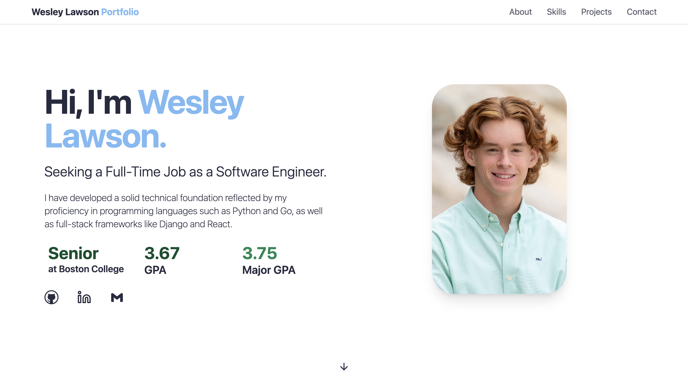

# Wesley Lawson Portfolio

Welcome to my personal portfolio website — a modern, responsive site built to showcase my projects, experience, and a little bit about who I am.

 

## Overview

This portfolio serves as a central hub for:
- Highlighting my **projects** and technical work.
- Sharing my **resume** and professional background.
- Providing **contact information** for collaboration and opportunities.
- Offering occasional **updates** on my personal and professional growth.

I built this site as a way to **learn React and TailwindCSS** while developing something meaningful. It’s lightweight, fast, and deployed through Vercel for seamless hosting and CI/CD integration.

## Tech Stack

- **Frontend:** React  
- **Styling:** TailwindCSS  
- **Deployment:** Vercel  

## Features

- Fully responsive design for all screen sizes  
- Modern UI built with TailwindCSS utility classes  
- Smooth navigation between sections (About, Projects, Contact, etc.)  
- Easy-to-update structure for future improvements and content additions  

## Deployment

This project is live on **Vercel**.

 **Live Site:** [https://wesley-lawson-portfolio-gi7t.vercel.app/](https://wesley-lawson-portfolio-gi7t.vercel.app/)